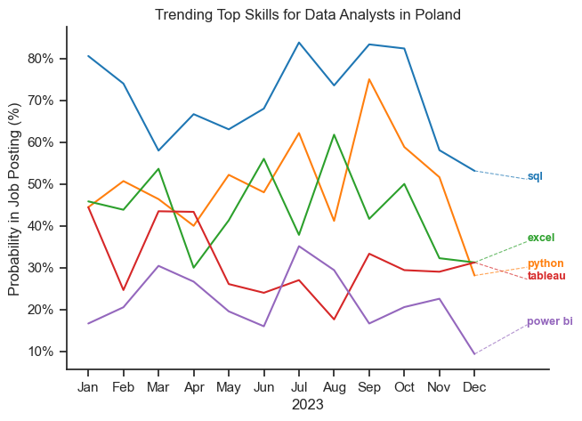
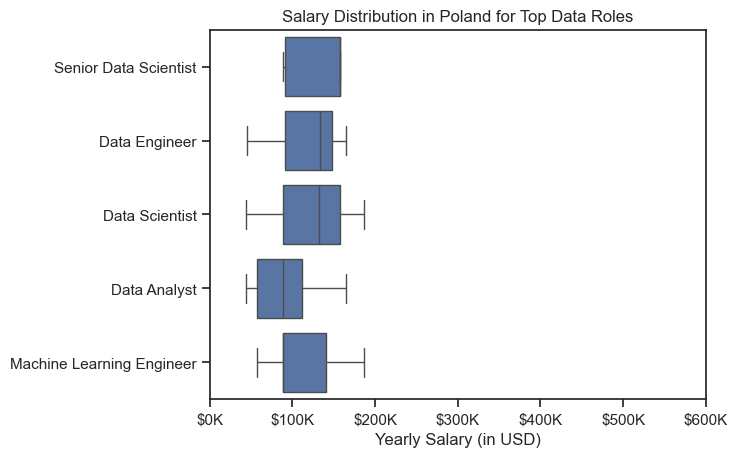
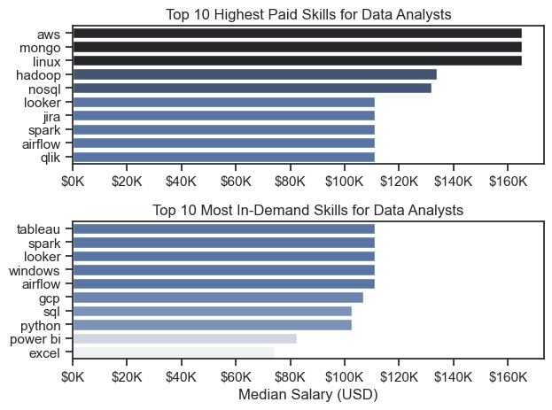
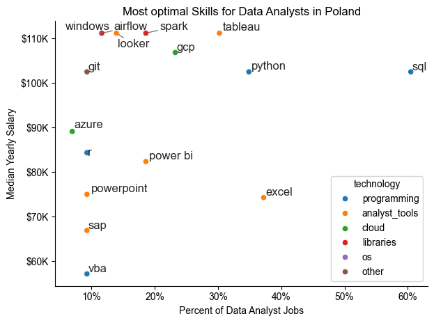

# DISCLAIMER

## Im currently working on this project, so this section might be still not finished but feel free to check it out


# The Analysis

## 1. What are the most demanded skills for the top 3 most  popular data roles?

To find the most in-demand skills in the data industry, I analyzed job postings to identify the top three most popular data roles. Then, I selected the five most common skills for each role. This shows which skills are most valuable for people who want to grow in these positions.

View my notebook with detailed steps here: [2_Skills_Demand.ipynb](Project/2_Skills_Demand.ipynb)

### Visualize Data

```python

fig, ax = plt.subplots(len(job_titles), 1)

for i, job_title in enumerate(job_titles):
    df_plot = df_skills_perc[df_skills_perc['job_title_short'] == job_title].head(5)
    sns.barplot(data = df_plot, x='skill_percent', y='job_skills', ax=ax[i], hue = 'skill_percent', palette='dark:b_r')
    ax[i].set_ylabel('')
    ax[i].set_xlabel('')
    ax[i].legend().remove()
    ax[i].set_xlim(0, 75)

    for n, v in enumerate(df_plot['skill_percent']):
        ax[i].text(v+1, n, f'{v:.0f}%', va='center')

    if i != len(job_titles) - 1:
        ax[i].set_xticks([])
fig.suptitle('Likelihood of Skills Requested in Poland Job Postings', fontsize=15)
fig.tight_layout()
plt.show()

```

### Results


### Insights

#### General Conclusions
- Python and SQL are the two most important and universal skills across all data-related roles in Poland.
They appear as top requirements for Data Analysts, Data Engineers, and Data Scientists, showing that coding and database querying are essential in nearly every position.
- Cloud technologies (Azure, AWS) and data visualization tools (Tableau, Power BI) are becoming standard expectations, depending on the nature of the role.
- Each position emphasizes a slightly different skill mix — analysts focus on business tools, engineers on infrastructure, and scientists on modeling and analytics.

⸻

#### Data Analyst
- Core skills: SQL (50%) and Excel (37%) remain crucial for handling and preparing data.
- Python (30%) appears as a growing technical requirement, especially for automation and advanced analysis.
- Visualization tools like Tableau (22%) and Power BI (20%) highlight the importance of communicating insights effectively.

⸻

#### Data Engineer
- The role is dominated by Python (63%) and SQL (63%), emphasizing data pipeline and ETL development.
- Strong demand for Azure (41%), AWS (35%), and Spark (35%) reflects the shift toward cloud-based and distributed data systems.
- The skill set is clearly more technical and infrastructure-oriented compared to other roles.

⸻

#### Data Scientist
- Python (60%) and SQL (52%) are key foundational skills, showing overlap with engineering competencies.
- R (22%) is still relevant for statistical analysis and academic-style modeling.
- Azure (19%) and AWS (17%) suggest growing expectations for cloud-based machine learning deployment.


## 2. How are in-demand skills trending for Data Analysts?

### Visualize Data

```python

plt.figure(figsize=(7,5))
sns.lineplot(data=df_plot, dashes=False, palette='tab10')
sns.set_theme(style="ticks")
sns.despine()

plt.title('Trending Top Skills for Data Analysts in Poland')
plt.ylabel('Probability in Job Posting (%)')
plt.xlabel('2023')
plt.legend().remove()

from matplotlib.ticker import PercentFormatter
ax = plt.gca()
ax.yaxis.set_major_formatter(PercentFormatter())

palette = sns.color_palette('tab10')
offsets = [-2, 2, 5, -4, 7]

texts = []
for i, col in enumerate(df_plot.columns[:5]):
    x_pos = len(df_plot) - 1 
    y_pos = df_plot.iloc[-1, i]
    label_x = len(df_plot) + 0.5
    label_y = y_pos + offsets[i]

    # line connecting point to label
    plt.plot([x_pos, label_x], [y_pos, label_y],
        color=palette[i], lw=0.8, ls='--', alpha=0.7)

    texts.append(
        plt.text(
            label_x,
            label_y,
            col,
            fontsize=9,
            weight='bold',
            color=palette[i]
        )
    )

```



## 3. How well do jobs and skills pay for Data Analysts?

### Salary Analysis for Data Industry

#### Visualize Data

```python

sns.boxplot(data = df_PL_top5, x='salary_year_avg', y='job_title_short', order = job_order)
sns.set_theme(style = 'ticks')

plt.title('Salary Distribution in Poland for Top Data Roles')
plt.xlabel('Yearly Salary (in USD)')
plt.ylabel('')
plt.xlim(0, 600000)
ticks_x = plt.FuncFormatter(lambda y, pos: f'${int(y/1000)}K')
plt.gca().xaxis.set_major_formatter(ticks_x)
plt.show()

```

#### Results


*Box plot visualizing the salary distributions for the top 5 (Software Engineer was omited due to low data sample) data job titles.*


#### Insights


💼 Salary Distribution for Top 5 Data-Related Roles in Poland

The boxplot illustrates that the Senior Data Scientist role has the highest median salary among the group, with the smallest overall distribution across job postings — indicating a more consistent pay range.

In contrast, Data Analyst positions tend to cluster below the 100K PLN annual mark. While roles such as Data Engineer, Data Scientist, and Machine Learning Engineer generally offer higher pay potential, their salary distributions are much more dispersed, suggesting greater variability depending on the specific posting.

An important observation is that data-related roles in Poland show no significant outliers on the boxplot, unlike in countries such as the United States, where salary ranges are often more extreme due to higher market diversity and cost of living differences.

*It is worth noting that the chart presents the top five most common data-related roles in Poland. However, the Software Engineer position — originally ranked fifth — was excluded due to a limited sample size, and the Machine Learning Engineer role was included instead.*


### Highest Paid & Most In-Demand Skills for Data Analysts in the 



#### Insights

- The top graph shows specialized technical skills like 'aws', 'mongo' or 'hadoop'. They are associated with higher salaries, some reaching above $150K, suggesting that advanced technical niche skills can increase earning potential.

- The bottom chart highlights that foundational skills such as Excel, Power BI, and Python are among the most in-demand in the job market, even though they do not necessarily correspond to the highest salaries. This emphasizes the importance of these core competencies for employability in data analysis roles, while also suggesting that they may offer limited leverage in salary negotiations.

- There is no overlap between these two graphs, indicating that the most in-demand skills do not necessarily lead to higher-paying jobs, but rather improve employability. To increase salary potential, it is advisable to develop specialized expertise in a particular skill, such as 'aws' or 'mongo'.

## 4. What is the most optimal skill to learn for Data Analysts?

#### Visualize Data

```python
sns.scatterplot(
    data = df_plot,
    x= 'skill_percent',
    y= 'median_salary',
    hue= 'technology'
)

sns.despine()
sns.set_theme(style = 'ticks')

texts = []
for i, txt in enumerate(df_DA_skills_high_demand.index):
    texts.append(plt.text(df_DA_skills_high_demand['skill_percent'].iloc[i], df_DA_skills_high_demand['median_salary'].iloc[i], txt))

#Adjust text to avoid overlap
adjust_text(texts, arrowprops=dict(arrowstyle='->', color='grey'))

plt.xlabel('Percent of Data Analyst Jobs')
plt.ylabel('Median Yearly Salary')
plt.title('Most optimal Skills for Data Analysts in Poland')

from matplotlib.ticker import PercentFormatter
ax = plt.gca()
ax.yaxis.set_major_formatter(plt.FuncFormatter(lambda y, pos: f'${int(y/1000)}K'))
ax.xaxis.set_major_formatter(PercentFormatter(decimals=0))
plt.tight_layout()
plt.show()
```

### Results


#### Insights:
- The scatter plot shows that most of the 'programming'  skilss (colored blue) tend to cluster at higher salary levels compared to other categories, indicatin that programming expertise might offer greater salary benefits within the data analytics field.

- Analyst tools (colored oragne) are the biggest fraction of technologies, where tableu and excel are the most common in job postings. Tableu looks like good skill to learn, as its really common in job postings, giving one of the highest salaries

- The cloud technology is not as common in job postings, and apperas only as two skills on the visual (azure and gcp) but you can expect them, to be high salary jobs as the cloud technology become more and more relewant in the Analytics field